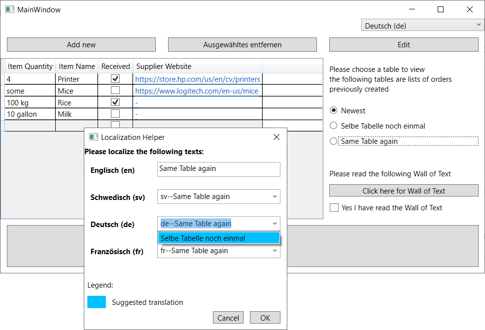
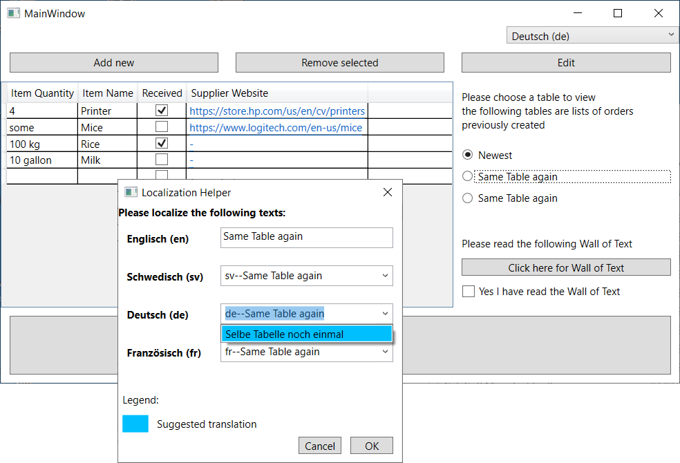
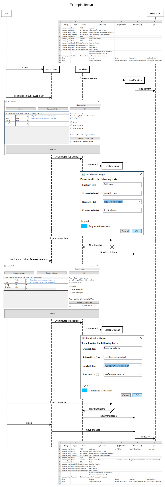
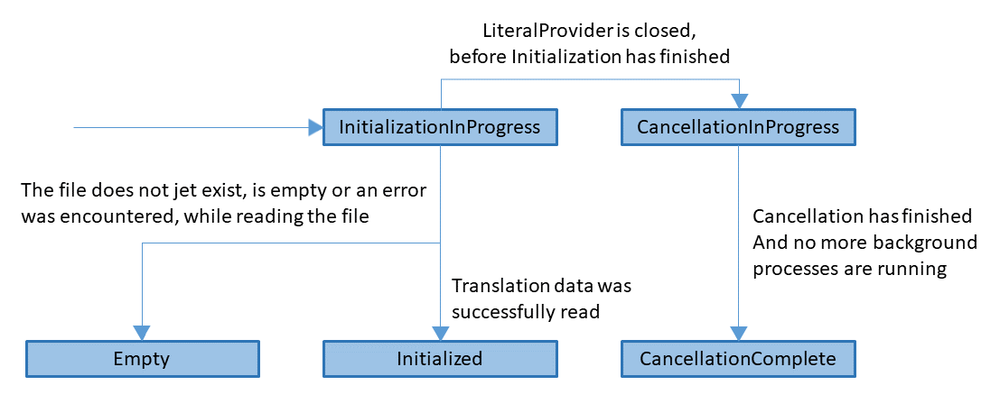
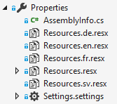

* [Introduction](#intro)
  * [Problem](#problem)
  * [Idea](#idea)
  * [Use Cases](#usecases)
* [Getting Started](#setup)
  * [Prerequisites](#prerequisites)
    * [Installations required](#installs)
    * [Files required](#filesrequired)
  * [Preparing the Views / Windows](#viewpreperation)
    * [Localization-Component](#localizationpreperation)
    * [Translation-Component](#translationpreperation)
  * [Initializing the Components](#init)
    * [Loading the translation files](#initfiles)
    * [Loading the translation into the application](#initlp)
  * [Translating the Views](#translate)
  * [Saving the translations](#saving)
  * [Switching between Languages *(optional)*](#switchinglanguages)
* [Further Notes](#usage)
  * [Exiting](#exit)
    * [Exiting and saving](#exitsave)
    * [Exiting without saving](#exitnosave)
  * [Reading / Writhing Files](#readingwriting)
    * [Saving translations to .xlsx (ExcelFileProvider)](#excelfp)
    * [Saving translations to .json (JsonFileProvider)](#jsonfp)
  * [Translating Views and Windows](#translating)
* [Information for developers](#devinfo)
  * [Components](#components)
  * [Lifecycle](#lifecycle)
    * [Whole Application](#applifecycle)
    * [IFileProvider](#fplifecycle)
  * [Code Style](#codestyle)
* [Quickstart-Checklist and Examples](#checklist)
  * [Excel](#excelquickstart)
  * [Resources](#resourcequickstart)

# WPF-GUI-Localizer

<a id="intro"></a>
## Introduction

This library offers the functionality to add or optimize localization in WPF applications. By applying a right-click event to every localizable element (Label, Button etc.), it opens a window in which the translations of the given elements text can be edited for any available language.

It comes along with tools to localize WPF applications using either human-readable Excel files or traditional Resources (.resx) files.

<a id="problem"></a>
### Problem
Many applications have this problem: translations are done by external service contractors, which translate specific text "out of context", outside of the application. This results in the problem that these contractors have trouble to translate specific text correctly, since certain words might translate to multiple others, depending on the context. For abbreviations, the translators might have to resort to glossaries, if any are available. There is a considerable chance for errors.

<a id="idea"></a>
### Idea
The idea behind this library is to translate applications within its live context, inside the application itself. In order to do so, a click event is added to the given application that opens a dialog whenever a translatable object (e.g. Label) is right-clicked.


In the given dialog, the translations for all desired languages can be edited and saved, in order to load them into the live application when the work has been finished.

Since this dialog has the full knowledge of the existing translations, it can offer the user translations based on previously translated texts. With this feature, the process of translation can be sped up the more texts have been translated. Repeating words can be translated coherently.



Currently supported ways of localization:

1. Translations based on *Resources files* (.resx) - minor changes have to be made in the way texts are loaded in order to use this library. More info on it in [Use Cases - Resource](#usecaseres). *(note that this library does not support editing Resources files directly)*
2. Translations based on *Excel files* (.xlsx) - this library is shipped with an integrated method to load translations for the user interface based on an Excel file, if desired. More info on it in [Use Cases - Excel](#usecaseexcel).

<a id="usecases"></a>
### Use Cases

<a id="usecaseres"></a>
#### Resource
Benefits of the Resource Use Case include:
* Resources files that were used to localize the application prior to using this library, can be used.
* Writing / Reading is fast, which will affect the Launching and Closing time of your application less.
* The application can run without overriding texts in GUI-elements.
* Two or more elements from different Views can share a translation.

This Use Case is recommended if you
* Are concerned about the speed of your application.
* Have an application in which overriding the text in elements is unwanted.
* Already have Resources files and want to validate / correct individual translations in the GUI.

<a id="usecaseexcel"></a>
#### Excel
Benefits of the Excel Use Case include:
* All localization information can be found in one central file that can be opened almost universally.
* Format is human reader friendly (Comments, 3 different columns for dialog name, control type and name).
* Less code modifications are necessary for adding or removing library.

This Use Case is recommended if you
* Are unsure whether to keep the library or not and want to minimize time lost due to code rewriting.
* Plan on exchanging the translations regularly or at all e.g. through E-mail.
* Have translations for some / all Texts used in the GUI as an Excel sheet.

#### Distinction
Although any combination of LiteralProvider and FileProvider should work just fine, for simplicity's sake,
the Resource Use Case is defined as using the ```ResourceLiteralProvider``` with a ```JsonFileProvider``` and
the Excel Use Case is defined as using the ```FileLiteralProvider``` with an ```ExcelFileProvider```.

<a id="setup"></a>
## Getting Started

<a id="prerequisites"></a>
### Prerequisites

<a id="installs"></a>
#### Installations required

The .NET Framework version 4.7.2 as well as Excel have to be installed.

The [WPF-GUI-Localizer](https://www.nuget.org/packages/GUILocalizer/) NuGet package has to be added to your project.

<a id="filesrequired"></a>
#### Files required

<a id="filesrequiredExcel"></a>
##### Files required for Excel use case

In case of the Excel use case, you may decide to either use an existing Excel sheet or run the application without one. In case you plan on using an existing sheet, you may place this file in the same folder as the executable. If you want to place the file elsewhere like a subfolder, use the appropriate relative path in [Loading the translation files](#initfiles).

If you are using an existing sheet, the first worksheet of this file will need to have a first row similar to this example:

| Dialog | Type | Name | English (United Kingdom) (en-GB) | (sv) Swedish | Deutsch (de) | fr |
| --- | --- | --- | --- | --- | --- | --- |
|     |     |     |     |     |     |     |

The list of languages used in the Excel sheet should include the original language of the application.

If no Excel sheet is supplied, the library will create a new sheet at the location specified in [Loading the translation files](#initfiles).

##### Files required for Resources use case

In case of the Resources use case, Resources (.resx) files will need to be used / created for each language that is meant to be localized. These files need to be inside the Properties folder of the application and the Resources file for the original language of the application needs to be filled with the current texts used in the application. More information on the Resources files will be presented in the next section about Preparing the Views / Windows.

All existing Resources files can stay unmodified.

<a id="viewpreperation"></a>
### Preparing the Views / Windows

<a id="localizationpreperation"></a>
#### Localization-Component

In order to attach the click-event for the core translation feature to a View / Window, the ```isActive``` attached property of ```LocalizationProperties``` has to be set to true for the corresponding View. This value may also be toggled during runtime in order to turn Translation mode on or off.

These two lines need to be added to the Views / Windows root element in the XAML file for the translation feature to work:
```xaml
xmlns:internat="clr-namespace:Internationalization.AttachedProperties;assembly=GUILocalizer"
internat:LocalizationProperties.IsActive="True"
```

When done translating the application, these entries can be removed - or "IsActive" can be bound to a modifiable property in the Settings-file in order to toggle the translation feature on and off.
The translation feature should not be running for the end user in order to not impair user experience.

<a id="translationpreperation"></a>
#### Translation-Component

##### XAML modifications needed for Excel use case
All GUI-elements intended for translation need to have a "Name"-Property which is a unique key inside their View or Window. All Views and Windows need to have a "Name"-Property that uniquely identifies them as well.

Note: in cases, where usually localizable elements have nested elements e.g. a Label is placed inside of a CheckBoxes Content, the Label has to have a Name as well. If this is not the case, the library will replace the Label and all other elements inside the CheckBoxes Content with the translation.

If the Headers of DataGrids need to be localized as well, they will need to have a "Name" attached property provided by this library assigned to each DataGridColumn. This is necessary as the DataGridColumns are not FrameworkElements and therefore do not support the ```NameProperty```.

The "Name" attached property can be added to a DataGrid Column like this
```xaml
<DataGridTextColumn internat:DataGridProperties.Name="dgcQuantity" />
```

<a id="translationpreperationRes"></a>
##### XAML modifications needed for Resources use case
All GUI-elements intended for translation need to have a ```ResourceKey``` attached property, containing the corresponding key from the Resources file. This allows for the Resources key to be read at runtime.

For example if your Resources.en.resx file has this entry:

| Name | Value | Comment |
| ---- | ----- | ------- |
| ItemListQuantity | Item Quantity | |
| | | |

and it is currently used similar to this:

```xaml
<DataGridTextColumn Header="{x:Static properties:Resources.ItemListQuantity}" Binding="{Binding Quantity}" />
```

Then the ```ResourceKey``` Property has to be attached like so:

```xaml
<DataGridTextColumn
    internat:ResourcesProperties.ResourceKey="ItemListQuantity"
    Header="{Binding RelativeSource={RelativeSource Self},
        Path=(internat:ResourcesProperties.ResourceKey),
        Converter={StaticResource ResourcesTextConverter}}"
    Binding="{Binding Quantity}" />
```

The library uses a converter to convert the key into its corresponding value out of the Resources files. You will need to add this to your Views or applications Resources:

```xaml
<Application.Resources>
  <internatConverter:ResourcesTextConverter x:Key="ResourcesTextConverter" />
</Application.Resources>
```

In order to get the attached property and the converter into the view, the following namespaces must be declared:

```xaml
xmlns:internatConverter="clr-namespace:Internationalization.Converter;assembly=GUILocalizer"
xmlns:internat="clr-namespace:Internationalization.AttachedProperties;assembly=GUILocalizer"
```

<a id="init"></a>
### Initializing the Components

<a id="initfiles"></a>
#### Loading the translation files

##### ExcelFileProvider for Excel use case
You can create an  instance of ```ExcelFileProvider``` using its constructor
```c#
ExcelFileProvider(string translationFilePath, [string glossaryTag], [string oldTranslationFilePath])
```

```translationFilePath``` is where ```ExcelLiteralProvider``` will search for the Excel file / create a new one. Use the path of the file relative to the executable including the files name and file extension here.

If the file is automatically created it will be filled with the current language of the OS and the ```Inputlanguage``` given in [Loading the translations into the application](#initlp) as soon as any edits are made.

```glossaryTag``` marks entries in the excel sheet that are part of a glossary and used for speeding up the translation process without being assigned to any specific element. If no value, null or an empty string is given, this feature will not be active.

```oldTranslationFilePath``` if given, a backup of the excel sheet will be saved there prior to any modifications by the library.

##### JsonFileProvider for Resources use case
You can create an instance of ```JsonFileProvider``` using
```c#
JsonFileProvider(string translationFilePath)
```

```translationFilePath``` is where ```JsonFileProvider``` will search for the JSON-file. This file does not need to be created manually.

<a id="initlp"></a>
#### Loading the translations into the application

In order to initialize a localization feature (Excel file or Resources), the LiteralProvider's ```Initialize``` function has to be called, which creates the Instance in the ```AbstractLiteralProvider```. The instance and therefore also ```GuiTranslator``` and ```Localizer```, which are dependent on it, can not be used before initialization is complete.

If ```AbstractLiteralProvider.Instance``` is called before initialization has finished, ```AbstractLiteralProvider``` will wait for the initialization process to finish before returning the instance and use a Dispatcher to continuously push new frames to the UI, in order to not freeze up the UI during the initialization process.

To avoid indirectly accessing ```AbstractLiteralProvider.Instance``` prior to starting the initialization process by loading a view, which has been set up to be translated by ```GuiTranslator``` or ```ResourcesTextConverter``` on load, it is recommended to call the following function on Application start up:

```c#
FileLiteralProvider.Initialize(IFileProvider fileProvider, CultureInfo inputLanguage,
  [CultureInfo preferedLanguage])
```
when using Excel-based localization, or
```c#
ResourceLiteralProvider.Initialize(IFileProvider fileProvider, CultureInfo inputLanguage,
  [CultureInfo preferedLanguage])
```
when using Resource-based localization.

```fileProvider``` should be the appropriate FileProvider from [Loading the translation files](#initfiles) for your use case.

```inputLanguage``` represents the language your application was originally created in.

```preferedLanguage``` is optional and determines what language to use as basis for translation dummy texts (e.g. "fr--Save" instead of "fr--Speichern" if the application was originally German and ```preferedLanguage``` is English). If no ```preferedLanguage``` is specified, English will be used.

<a id="translate"></a>
### Translating the Views

#### GuiTranslator as general translator
The ```GuiTranslator``` can be used to translate a whole view or window.

```GuiTranslator``` is essential for the Excel use case and needs to be called after the View / Window was loaded as well as after each time ```Thread.CurrentThread.CurrentUILanguage``` gets altered.

For the Resource use case ```GuiTranslator``` does not need to be called after the View or Window was loaded, but can still be called after ```Thread.CurrentThread.CurrentUILanguage``` gets altered.
Alternatively the View / Window can be reloaded after changing ```Thread.CurrentThread.CurrentUILanguage```, in which case ```GuiTranslator``` will not need to be called explicitly at all. 

To call ```GuiTranslator``` for a View or Window, call
```c#
GuiTranslator.TranslateGui(FrameworkElement rootElement)
```
This will translate all elements nested inside ```rootElement```.

#### ResourcesTextConverter for Resources use case
The ```ResourcesTextConverter``` can be used to translate an individual GUI-element.

If the Views / Windows are prepared like described in [XAML modifications needed for Resources use case](#translationpreperationRes), Views and Windows will automatically be translated according to ```Thread.CurrentThread.CurrentUILanguage```, once the binding expression is evaluated.

If the translations need to be updated, the View / Window can be reloaded / reopened to re-evaluate the binding expression or ```GuiTranslator``` can be called like described above.

<a id="saving"></a>
### Saving the translations

When exiting the application, the altered texts, which have not been permanently stored so far, should be written into their original translation files.

Note: It is recommended to skip the saving step, if the ability to alter the translations is turned off.

To save translations, call
```c#
AbstractLiteralProvider.Instance.Save()
```

<a id="switchinglanguages"></a>
### Switching between Languages *(optional)*

The language may be changed at runtime by changing ```Thread.CurrentThread.CurrentUICulture```.
Since the act of doing so after the View / Window was loaded does not translate the View / Window, one can either
* use ```GuiTranslator``` to run the translator for the view manually.
* reload the View / reopen the Window (This is only applicable if ```ResourceLiteralProvider``` is used).

<a id="usage"></a>
## Further Notes

<a id="exit"></a>
### Exiting

<a id="exitsave"></a>
#### Exiting and saving

##### ```AbstractLiteralProvider.Instance.Save()```
Calling ```AbstractLiteralProvider.Instance.Save()``` guarantees changes made to the translations will be saved. If necessary, ```AbstractLiteralProvider``` will wait for the initialization process to finish and use a Dispatcher to continuously push new frames, in order to not freeze up the UI during the initialization process.

##### ```AbstractLiteralProvider.Exit(true)```
If possible, changes made to the translations will be saved. If initialization has not finished, it will be aborted and changes will not be saved. Until the cancellation process has finished, ```AbstractLiteralProvider``` will use a Dispatcher like described above.

*In some cases calling ```AbstractLiteralProvider.Exit(true)``` may take as much time as calling no function.*

<a id="exitnosave"></a>
#### Exiting without saving

##### ```AbstractLiteralProvider.Exit(false)```
The changes made to the translations will not be saved and initialization will be stopped, if it has not finished. Until the cancellation process has finished, ```AbstractLiteralProvider``` will use a Dispatcher  like described above.

*In some cases calling ```AbstractLiteralProvider.Exit(false)``` may take as much time as calling no function.*

##### no function called
The changes made to the translations will not be saved and if initialization has not finished, its thread will stay active until completed. No Dispatcher will be used.

<a id="readingwriting"></a>
### Reading / Writing Files

<a id="excelfp"></a>
#### Saving translations to .xlsx (ExcelFileProvider)
The ```ExcelFileProvider``` saves files in a human readable manner, but is also relatively slow. It is therefore recommended in combination with the ```FileLiteralProvider```, since it will store all translations needed for localization using the FileProvider, unlike ```ResourceLiteralProvider```.

##### File Format
| #1 Part of Key | #2 Part of Key | ... | #1 Language | #2 Language | ... |
| --- | --- | --- | --- | --- | --- |
| key1_part1 | key1_part2 | ... | translation1_language1 | translation1_language2 | ... |
| key2_part1 | key2_part2 | ... | translation2_language1 | translation2_language2 | ... |

##### Reading
The ```ExcelFileProvider``` will always open the Excel file at the path ```translationFilePath``` given in the constructor and search the first worksheet of that file.
The first row will be interpreted as column headers. ```ExcelFileProvider``` will search these headers for language tags e.g. en-GB, fr-FR. For a full list of all language tags supported please refer to [this page](https://docs.microsoft.com/openspecs/windows_protocols/ms-lcid/a9eac961-e77d-41a6-90a5-ce1a8b0cdb9c).
A header will be interpreted as header of a translations column, if it is a language tag like "en-US" or "ru" or contains a language tag in parenthesis at the end like "Dansk (da)" or "Italian (it-IT)". Both "Portuguese (Brazil) (pt-BR)" and "(de) German" are also accepted, however "(en-AU) English (Australia)" would not be interpreted correctly.

Starting from the left, the first column that can be interpreted as a translations column, divides the columns.
All columns prior will be interpreted as containing the key that uniquely identifies the row. All columns after the dividing column including itself, will be used for the translations.
Incase of ```FileLiteralProvider``` 3 columns (name of View / Window, Type of element, name of element) are needed to identify a row.
Incase of ```ResourceLiteralProvider``` only 1 column is needed (name of Resources entry).

##### Comments
Comments may be included in the sheet. They are identified by not having a value in the second column.
If ```FileLiteralProvider``` is used, comments may be included like this:

| Dialog | Type | Name | German (de) | English (en) | Lithuanian (lt) | Swedish (sv) |
| --- | --- | --- | --- | --- | --- | --- |
| MainWindow here |     |     |     |     |     |     |
| wndMainWindow | Button | NavToNameView | Name | Name | lt--Name | sv--Name |
| wndMainWindow | Button | Confirm | Bestätigen | Confirm | lt--Confirm | sv--Confirm |
| next up Views |     |     |     |     |     |     |
| viewDataEditing | Button | Add | Hinzufügen | Add | lt--Add | sv--Add |
| viewDataEditing | TextBlock | 3rdAttribute | Attribut 3 | Attribute 3 | lt--Attribute 3 | sv--Attribute 3 |
| viewDataEditing | Button | Confirm | Bestätigen | Confirm | lt--Confirm | sv--Confirm |

while using ```ResourceLiteralProvider``` comments may be included like this:

| Resource Key | German (de) | English (en) | Lithuanian (lt) | Swedish (sv) |
| --- | --- | --- | --- | --- |
| MainWindow Navigation |     |     |     |     |
| btnNavToNameView | Name | Name | lt--Name | sv--Name |
| Often used Button texts |     |     |     |     |
| btnConfirm | Bestätigen | Confirm | lt--Confirm | sv--Confirm |
| Editing values |     |     |     |     |
| btnAdd | Hinzufügen | Add | lt--Add | sv--Add |
| lbl3rdAttribute | Attribut 3 | Attribute 3 | lt--Attribute 3 | sv--Attribute 3 |

If only 1 column is used for the key, the first translations column has to be filled, otherwise some rows will be ignored. It is therefore recommended to only add new languages at the end and not insert them right after the key columns. If the Excel sheet has been filled prior to using this library and only one key column is used, please verify that the whole second column is filled. This does not cause problems if the sheet is filled by the library, as all key and translations columns will be filled at the same time.

##### Glossary
In order to get translation recommendations without having translated the given text somewhere else in the GUI, a glossary can be included in the Excel sheet. One major use case for a glossary is for abbreviations used in your application that are hard to translate for external contractors, who may not be familiar with some of your industry specific terminology. This way translation can be picked from the drop down menu like in this screenshot:



A Glossary entry may be included like this for a ```FileLiteralProvider```:

| Dialog | Type | Name | German (de) | English (en) | Lithuanian (lt) | Swedish (sv) |
| --- | --- | --- | --- | --- | --- | --- |
| Glossary |  |  | Bestätigen | Confirm | Patvirtinti | Bekräfta |

or like this for a ```ResourceLiteralProvider```:

| Resource Key | German (de) | English (en) | Lithuanian (lt) | Swedish (sv) |
| --- | --- | --- | --- | --- |
| Glossary | Bestätigen | Confirm | Patvirtinti | Bekräfta |

The glossary entry identifier (here: "Glossary") has to be the same as the value used for ```glossaryTag``` in [Loading the translation files](#initfiles).

##### Writing
If ```ExcelFileProvider``` was given a value for ```oldTranslationFilePath```, it will save the initial sheet under that path and not override it, unless the file can no longer be found under ```oldTranslationFilePath```.

If keys given to ```ExcelFileProvider``` contain ```|```s, they will be split up into individual columns. ```FileLiteralProvider``` will always give its FileProvider a key that is made up of name of View/Window + ```|``` + type of element + ```|``` + name of element.

If ```ExcelFileProvider``` receives a key with a number of ```|``` that does not align with the number of columns it recognized in the Excel sheet, it will either not use up all columns (this can cause problems with the comment recognition) or write all additional key parts into the last column including the ```|```s.

<a id="jsonfp"></a>
#### Saving translations to .json (JsonFileProvider)
The ```JsonFileProvider``` saves files in a less human readable manner, but it is relatively fast thanks to the usage of Json.NET. It is therefore recommended in combination with the ```ResourceLiteralProvider```. Since ```ResourceLiteralProvider``` does not store all translations needed for localization using its FileProvider, it is less likely that the file will have to be read by a user.

##### File Format
```json
{
  "#1 Language": {
    "key1": "translation1_language1",
    "key2": "translation2_language1"
  },
  "#2 Language": {
    "key1": "translation1_language2",
    "key2": "translation2_language2"
  },
}
```

##### Glossary
In order to get translation recommendations without having translated the given text somewhere else in the GUI, a glossary can be included in the json file. One major use case for a glossary is for abbreviations used in your application that are hard to translate for external contractors, who may not be familiar with some of your industry specific terminology. This way translation can be picked from the drop down menu like in this screenshot:


Glossary entries may be included like this for either LiteralProvider:

```json
{
  "en": {
    "Glossary1": "Confirm",
    "Glossary2": "Accept"
  },
  "lt": {
    "Glossary1": "Patvirtinti",
    "Glossary2": "Priimti"
  },
  "sv": {
    "Glossary1": "Bekräfta",
    "Glossary2": "Acceptera"
  }
}
```

The glossary entry identifier (here: "Glossary1", "Glossary2") has to be the unique, in order to determine what entries belong together.

<a id="translating"></a>
### Translating Views and Windows

#### Usages
Views / Windows may be translated using ```GuiTranslator``` after ```Thread.CurrentThread.CurrentUICulture``` was changed or after they were loaded (only needed when using ```FileLiteralProvider```).

Views and Windows may alternatively also be translated by having an attached property ```ResourceKey``` and referencing this Property through a ```ResourcesTextConverter``` (only when using ```ResourceLiteralProvider```). This approach just like normal Resources localization only translates the View / Window once while it is being loaded.

GUI-elements are always automatically translated using ```GuiTranslator``` after the user edited their translation.

#### Supported GUI-elements
* RibbonTab
* RibbonGroup
* RibbonButton
* RibbonRadioButton
* RibbonApplicationMenuItem
* Label
* Button
* TabItem
* RadioButton
* TextBlock
* CheckBox
* DataGrids

#### GuiTranslator
```GuiTranslator``` supports the translation of all GUI-elements inside a UserControl or Window. Note however that UserControls nested inside other UserControls or Windows will be ignored.
Translating individual elements or a single Grid / Panel only is also supported.

#### ResourcesTextConverter
The ```ResourcesTextConverter``` supports converting a string to the value of the Resources file entry with a key that matched the given string. It will use ```AbstractLiteralProvider.Instance``` to get these entries. ```ResourcesTextConverter``` **only** works if ```AbstractLiteralProvider.Instance``` is a ```ResourceLiteralProvider``` and does not support the ```ConvertBack``` function.

For information about how to add the ```ResourcesTextConverter``` to an application read [XAML modifications needed for Resources use case](#translationpreperationRes).

<a id="devinfo"></a>
### Information for developers

<a id="components"></a>
### Components

This is a simplified class diagram of all key classes


1. ```IFileProvider``` - is used in order to read and write the existing translation dictionary of the target application from / to a given file.
1. ```ILiteralProvider``` - is used in order to read and change existing translations of the target application while utilizing the FileProvider. There are two implementations for the ```ILiteralProvider``` Interface:

   1. ```ResourceLiteralProvider``` - is used for applications that are translated using Resources (.resx) files. It reads the existing Resources in order to provide context to the translation and writes changes into a separate file using the FileProvider, since compiled resources files cannot be altered directly.
   1. ```FileLiteralProvider``` - is used for applications that might not already have a translation and want to transition to a File-based translation (e.g. Excel or JSON). It uses the FileProvider in order to load and store the entire translation dictionary from/into one file.

1. ```GuiTranslator``` - is used in order to update Texts in the GUI, for example when altering texts using this library.
1. ```Localizer``` - contains the core functionality of this library. It uses the attached property ```isActive``` (LocalizationProperties) in order to activate or deactivate the "Localization Helper" pop-up feature. If the feature is activated, it opens the translation dialog when clicking on any of the specified GUI-Elements. It sends the changes of the texts to the LiteralProvider, and reloads the GUI-Texts using the ```GuiTranslator```.

<a id="lifecycle"></a>
#### Lifecycle

<a id="applifecycle"></a>
##### Whole Application
The following diagram shows an example for how the application may be used and how the different key classes communicate information:



<a id="fplifecycle"></a>
##### IFileProvider
Both ```IFileProvider``` and ```ILiteralProvider``` implementations can only be in the States: InitializationInProgress, Empty, Initialized, CancellationInProgress or CancellationComplete. The following state diagram shows how they transition for a ```IFileProvider``` implementation:



In case of the ```FileLiteralProvider```, its State aligns with its FileProviders State, but this is not the case for ```ResourceLiteralProvider```. The ```ResourceLiteralProvider``` will hide its FileProviders during initialization and also never reach the Empty state.

<a id="codestyle"></a>
#### Code Style

A .editorconfig file can be found as part of the repository and is included in the solution as a solution item. If not automatically detected, set your editors formatting style to the one defined in .editorconfig. 

<a id="checklist"></a>
## Quickstart-Checklist and Examples

<a id="excelquickstart"></a>
### Excel

1. The WPF-GUI-Localizer NuGet package and its dependencies are added to your project.

2. ```FileLiteralProvider.Initialize``` is called before first usage of ```GuiTranslator``` or ```AbstractLiteralProvider.Instance```.
   ```AbstractLiteralProvider.Instance.Save``` or ```AbstractLiteralProvider.Exit``` is called before Application Exit.
   
   Example:
   ```c#
   public App()
   {
     this.Startup += OnStartup;
     this.Exit += OnExit;
   }
   
   private void OnStartup(object sender, StartupEventArgs e)
   {
     FileLiteralProvider.Initialize(new ExcelFileProvider("Resource/Language_File.xlsx"),
       new CultureInfo("en"));
   }
   
   private void OnExit(object sender, ExitEventArgs e)
   {
     AbstractLiteralProvider.Instance.Save();
   }
   ```
   
3. ```LocalizationProperties.IsActive``` is attached to all Views and Windows that need to be localized.
   
   Example:
   ```xaml
   <UserControl x:Class="ExcelExample.View.ExampleView"
       Name="Example_View"
       xmlns="http://schemas.microsoft.com/winfx/2006/xaml/presentation"
       xmlns:x="http://schemas.microsoft.com/winfx/2006/xaml"
       xmlns:mc="http://schemas.openxmlformats.org/markup-compatibility/2006" 
       xmlns:d="http://schemas.microsoft.com/expression/blend/2008"
       mc:Ignorable="d" 
       d:DesignHeight="450" d:DesignWidth="800"
       xmlns:internat="clr-namespace:Internationalization.AttachedProperties;assembly=GUILocalizer"
       internat:LocalizationProperties.IsActive="True">
     <Grid>
     
     </Grid>
   </UserControl>
   ```
   
4. GuiTranslator is called after Views were loaded.
   
   Example:
   ```c#
   public ExampleView()
   {
     InitializeComponent();
   
     this.Loaded += TranslateMe;
   }
   
   private void TranslateMe(object sender, EventArgs eventArgs)
   {
     GuiTranslator.TranslateGui(this);
   }
   ```
   
5. All GUI-elements and Views intended for translation have a unique name, including DataGridColumns.
   
   Example:
   ```xaml
   <DataGrid ItemsSource="{Binding Items}" AutoGenerateColumns="False">
     <DataGrid.Columns>
       <DataGridTextColumn Header="Item Quantity"
           internat:DataGridProperties.Name="dgcQuantity" />
       <DataGridTextColumn Header="Item Name"
           internat:DataGridProperties.Name="dgcName" />
       <DataGridCheckBoxColumn Header="Received"
           internat:DataGridProperties.Name="dgcRecived" />
       <DataGridHyperlinkColumn Header="Supplier Website"
           internat:DataGridProperties.Name="dgcWebsite" />
     </DataGrid.Columns>
   </DataGrid>
   ```
   
6. **optional** An Excel sheet similar to this exists at the path given in ```FileLiteralProvider.Initialize```:
   
   | Dialog | Type | Name | English (en) | (sv) Swedish | Deutsch (de) | (fr) |
   | --- | --- | --- | --- | --- | --- | --- |
   |     |     |     |     |     |     |     |
   
7. **optional** Property for current Language is added to MainWindow and can be controlled by user.
   
   Example:
   
   ViewModel:
   ```c#
   public CultureInfo SelectedLanguage
   {
     get => Thread.CurrentThread.CurrentUICulture;
     set
     {
       Thread.CurrentThread.CurrentCulture = value;
       Thread.CurrentThread.CurrentUICulture = value;
   
       GuiTranslator.TranslateGui(CurrentView);
     }
   }
   
   public IEnumerable<CultureInfo> TranslatableLanguages =>
     AbstractLiteralProvider.Instance.GetKnownLanguages();
   ```
   
   XAML:
   ```xaml
   <Window x:Class="ExcelExample.MainWindow"
       Name="Main_Window"
       xmlns="http://schemas.microsoft.com/winfx/2006/xaml/presentation"
       xmlns:x="http://schemas.microsoft.com/winfx/2006/xaml"
       xmlns:d="http://schemas.microsoft.com/expression/blend/2008"
       xmlns:mc="http://schemas.openxmlformats.org/markup-compatibility/2006"
       mc:Ignorable="d"
       Title="MainWindow" Height="450" Width="800"
       xmlns:internatConverter="clr-namespace:Internationalization.Converter;assembly=GUILocalizer">
     <Window.Resources>
       <internatConverter:CultureInfoStringConverter
           x:Key="CultureInfoStringConverter" />
       <internatConverter:CultureInfoCollectionStringConverter
           x:Key="CultureInfoCollectionStringConverter" />
     </Window.Resources>
     <Grid>
       <Grid.RowDefinitions>
         <RowDefinition Height="20" />
         <RowDefinition Height="*" />
       </Grid.RowDefinitions>
       <Grid.ColumnDefinitions>
         <ColumnDefinition Width="*" />
         <ColumnDefinition Width="200" />
       </Grid.ColumnDefinitions>
       <ComboBox Grid.Row="0" Grid.Column="1"
           ItemsSource="{Binding TranslatableLanguages,Converter={StaticResource CultureInfoCollectionStringConverter}}"
           SelectedItem="{Binding SelectedLanguage,Converter={StaticResource CultureInfoStringConverter}}"/>
       <Frame Grid.Row="1" Grid.Column="0" Grid.ColumnSpan="2" Name="CurrentView"
           NavigationUIVisibility="Hidden" Content="{Binding CurrentView, Mode=TwoWay}"/>
     </Grid>
   </Window>
   ```

<a id="resourcequickstart"></a>
### Resource

1. The WPF-GUI-Localizer NuGet package and its dependencies are added to your project.

2. ```ResourceLiteralProvider.Initialize``` is called before first usage of ```GuiTranslator``` or ```AbstractLiteralProvider.Instance```.
   ```AbstractLiteralProvider.Instance.Save``` or ```AbstractLiteralProvider.Exit``` is called before Application Exit.
   
   Example:
   ```c#
   public App()
   {
     this.Startup += OnStartup;
     this.Exit += OnExit;
   }
   
   private void OnStartup(object sender, StartupEventArgs e)
   {
     ResourceLiteralProvider.Initialize(new JsonFileProvider("Resource/Resource_Corrections.json"),
       new CultureInfo("en"));
   }
   
   private void OnExit(object sender, ExitEventArgs e)
   {
     AbstractLiteralProvider.Instance.Save();
   }
   ```
   
3. ```LocalizationProperties.IsActive``` is attached to all Views and Windows that need to be localized.
   
   Example:
   ```xaml
   <UserControl x:Class="ExcelExample.View.ExampleView"
       Name="Example_View"
       xmlns="http://schemas.microsoft.com/winfx/2006/xaml/presentation"
       xmlns:x="http://schemas.microsoft.com/winfx/2006/xaml"
       xmlns:mc="http://schemas.openxmlformats.org/markup-compatibility/2006" 
       xmlns:d="http://schemas.microsoft.com/expression/blend/2008"
       mc:Ignorable="d" 
       d:DesignHeight="450" d:DesignWidth="800"
       xmlns:internat="clr-namespace:Internationalization.AttachedProperties;assembly=GUILocalizer"
       internat:LocalizationProperties.IsActive="True">
     <Grid>
     
     </Grid>
   </UserControl>
   ```
   
4. ```ResourceKey``` AttachedProperty is added to all elements intended for translation.
   
   Example:
   
   ```xaml
   <DataGridTextColumn Header="Item Quantity"
       internat:ResourcesProperties.ResourceKey="ItemListQuantity" />
   ```
   
5. The following expression is assigned to the Property that receives the translated text for all elements intended for translation e.g. Content for Buttons, Header for DataGridColumns or Text for TextBlocks:

   ```
   {Binding RelativeSource={RelativeSource Self}, Path=(internat:ResourcesProperties.ResourceKey),
   Converter={StaticResource ResourcesTextConverter}}
   ```
   
   Example:
   
   ```xaml
   <DataGridTextColumn
       Header="{Binding RelativeSource={RelativeSource Self},
           Path=(internat:ResourcesProperties.ResourceKey),
           Converter={StaticResource ResourcesTextConverter}}"
       internat:ResourcesProperties.ResourceKey="ItemListQuantity" />
   ```
   
6. The Converter needed for translation is added into the Views or applications resources.
   
   Example:
   
   ```xaml
   <Application x:Class="Example_Resources.App"
       xmlns="http://schemas.microsoft.com/winfx/2006/xaml/presentation"
       xmlns:x="http://schemas.microsoft.com/winfx/2006/xaml"
       xmlns:vm="clr-namespace:Example_Resources.ViewModel"
       StartupUri="View/MainWindow.xaml"
       xmlns:internatConverter="clr-namespace:Internationalization.Converter;assembly=GUILocalizer">
     <Application.Resources>
       <internatConverter:ResourcesTextConverter x:Key="ResourcesTextConverter" />
     </Application.Resources>
   ```
   
7. Resources files exist in the Properties folder of your project for all languages needed including the original language
   
   Example:
   
   
   
8. At least the Resources file for your original language is filled with the correct texts
   
   Example:
   
   | Name | Value | Comment |
   | ---- | ----- | ------- |
   | ItemListQuantity | Item Quantity | |
   | | | |
   
8. **optional** Property for current Language is added to MainWindow and can be controlled by user.
   
   Example:
   
   ViewModel:
   ```c#
   public CultureInfo SelectedLanguage
   {
     get => Thread.CurrentThread.CurrentUICulture;
     set
     {
       Thread.CurrentThread.CurrentCulture = value;
       Thread.CurrentThread.CurrentUICulture = value;
   
       GuiTranslator.TranslateGui(CurrentView);
     }
   }
   
   public IEnumerable<CultureInfo> TranslatableLanguages =>
     AbstractLiteralProvider.Instance.GetKnownLanguages();
   ```
   
   XAML:
   ```xaml
   <Window x:Class="ExcelExample.MainWindow"
       Name="Main_Window"
       xmlns="http://schemas.microsoft.com/winfx/2006/xaml/presentation"
       xmlns:x="http://schemas.microsoft.com/winfx/2006/xaml"
       xmlns:d="http://schemas.microsoft.com/expression/blend/2008"
       xmlns:mc="http://schemas.openxmlformats.org/markup-compatibility/2006"
       mc:Ignorable="d"
       Title="MainWindow" Height="450" Width="800"
       xmlns:internatConverter="clr-namespace:Internationalization.Converter;assembly=GUILocalizer">
     <Window.Resources>
       <internatConverter:CultureInfoStringConverter
           x:Key="CultureInfoStringConverter" />
       <internatConverter:CultureInfoCollectionStringConverter
           x:Key="CultureInfoCollectionStringConverter" />
     </Window.Resources>
     <Grid>
       <Grid.RowDefinitions>
         <RowDefinition Height="20" />
         <RowDefinition Height="*" />
       </Grid.RowDefinitions>
       <Grid.ColumnDefinitions>
         <ColumnDefinition Width="*" />
         <ColumnDefinition Width="200" />
       </Grid.ColumnDefinitions>
       <ComboBox Grid.Row="0" Grid.Column="1"
           ItemsSource="{Binding TranslatableLanguages,Converter={StaticResource CultureInfoCollectionStringConverter}}"
           SelectedItem="{Binding SelectedLanguage,Converter={StaticResource CultureInfoStringConverter}}"/>
       <Frame Grid.Row="1" Grid.Column="0" Grid.ColumnSpan="2" Name="CurrentView"
           NavigationUIVisibility="Hidden" Content="{Binding CurrentView, Mode=TwoWay}"/>
     </Grid>
   </Window>
   ```

-----

Authors: [Martin Fabian Thomas, msg systems ag](mailto:martin.thomas@msg.group),
[Fabian Lewalder, msg systems ag](mailto:fabian.lewalder@msg.group)
