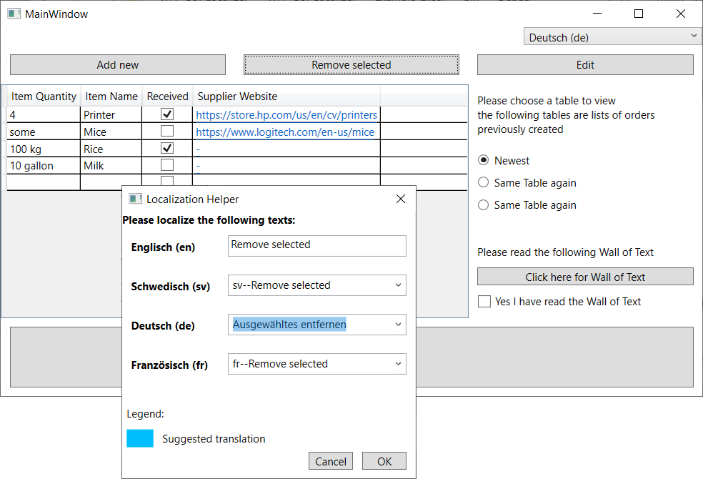

**!!This library is still under developement!!**

# WPF-GUI-Localizer

## Introduction

This library tackles the problem many software projects face: Translations are translated in form of tables, outside of the actual application, lacking the context given inside the application.
The library offers the functionality to alter translations at runtime as presented in the application using a pop-up window, as shown below.

It comes along with the ability to localize WPF applications using either human-readable Excel files or traditional Resources (.resx) files.

## Install

The WPF-GUI-Localizer library will be made available through NuGet once it reaches the distributable Version 1.0.

## Trying out the library

You can run an example application with this library already integrated in the Examples folder of this repository (no IDE required).

Alternatively you can open the WPF-GUI-Localizer solution in an IDE and run or debug the Example_Excel and Example_Resources projects.

Or read more about how to get set up with your own application [here](Docs/documentation.md#setup) or check out the quick-start-checklist for either [Excel based localization](Docs/documentation.md#excelquickstart) or [Resource file based localization](Docs/documentation.md#resourcequickstart).

## Documentation

The full documentation can be found [here](Docs/documentation.md)

## License

The WPF-GUI-Localizer library is licensed under the MIT License. See the file [LICENSE](LICENSE) for more details.

-----

Authors: [Martin Fabian Thomas, msg systems ag](mailto:martin.thomas@msg.group),
[Fabian Lewalder, msg systems ag](mailto:fabian.lewalder@msg.group)
