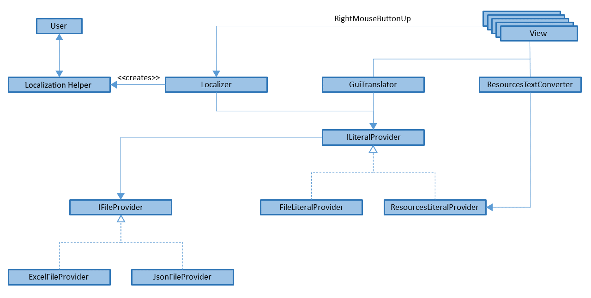

**!!This library is still under developement!!**

* [Introduction](#intro)
  * [Problem](#problem)
  * [Idea](#idea)
  * [Components](#components)
  * [Prerequisites](#prerequisites)
  * [Rough Architecture](#architecture)
  * [Use Cases](#usecases)
* [Setup](#setup)
  * [Translation](#translate)
  * [Localization Dialog](#dialog)
* [Usage](#usage)
  * [Initializing](#init)
    * [FileLiteralProvider](#initflp)
    * [ResourceLiteralProvider](#initrlp)
    * [ExcelFileProvider](#initefp)
    * [JsonFileProvider](#initjfp)
  * [Exiting](#exit)
  * [Saving Translations](#saving)
    * [ExcelFileProvider](#excelfp)
    * [JsonFileProvider](#jsonfp)
  * [Changing the language](#language)
  * [Translating Views and Windows](#translating)
* [Quickstart-Checklist and Examples](#checklist)
  * [Excel](#excelquickstart)
  * [Resources](#resourcequickstart)

# WPF-GUI-Localizer

<a id="intro"></a>
## Introduction

This library offers the functionality to add or optimize localization WPF applications. By applying a right-click event to every localizable element (Label, Button etc.), it opens a dialog in which the translations of the texts for given element in any language can be edited/added.

It comes along with tools to localize WPF applications using either human-readable Excel files or traditional Resources (.resx) files.

<a id="problem"></a>
### Problem
Many applications have this problem: translations are done by external service contractors, which translate specific text "out of context", outside of the application. This results in the problem that these contractors have trouble to translate specific text correctly, since certain words might translate to multiple others, depending on the context. For abbreviations, the translators might have to resort to glossaries, if any are available. There is a considerable chance for errors.

<a id="idea"></a>
### Idea
The idea behind this library is to translate applications within its live context, inside the application itself. In order to do so, a click event is added to the given application that opens a dialog whenever a translatable object (e.g. Label) is clicked.


In the given dialog, the translations for all desired languages can be edited and saved, in order to load them into the live application when the work has been finished.

Since this dialog has the full knowledge of the existing translations, it can offer the user translations based on previously translated texts. With this feature, the process of translation can be sped up the more texts have been translated. Repeating words can be translated coherently.


Currently supported ways of localization:

1. Translations based on *Resources files* (.resx) - minor changes have to be made in the way texts are loaded in order to use this library. More info on it in [Use Cases - Resource](#usecaseres). *(note that this library does not support editing Resources files directly)*
2. Translations based on *Excel files* (.xlsx) - this library is shipped with an integrated method to load translations for the user interface based on an Excel file, if desired. More info on it in [Use Cases - Excel](#usecaseexcel).


<a id="idea"></a>
### Components

This is a simplified class diagram of all key classes



1. FileProvider - is used in order to read the existing translation dictionary of the target application from a given file, depending on the technology used to implement the application. It is further used to write any changes of the translation dictionary of the target application into another given file. The input and output files might differ, again, depending on the technology used (see further below).
1. LiteralProvider - is used in order to read and change existing translations of the target application while utilizing the FileProvider. There are so two implementations for the LiteralProvider:

   1. ```ResourceLiteralProvider``` - is used for applications that are translated using Resources (.resx) files. It reads the existing Resources in order to provide context to the translation and writes changes into a separate file using the FileProvider, since compiled resources files cannot be altered directly.
   1. ```FileLiteralProvider``` - is used for applications that might not already have a translation and want to transition to a File-based translation (e.g. Excel or JSON). It uses the FileProvider in order to load and store the entire translation dictionary from/into one file (e.g. a translation Excel). It works using a "translation dictionary file", which contains the entire translation dictionary of the application, similar to a Resources (.resx) file but with all translations in one sheet.

1. ```GuiTranslator``` - is used in order to update Texts in the GUI, for example when altering texts using this library. If the application is using the file-based approach as translation technology (see FileLiteralProvider), the GuiTranslator is used in order to update the views using the translations from the translation dictionary file.
1. ```LocalizationUtils``` - contains the core functionality of this library. It uses the attached property ```isActive``` (LocalizationProperties) in order to activate or deactivate the translation feature for the GUI. If the translation feature is activated, it loads the translation dialogue when clicking on any of the specified GUI-Elements. If changes are made, it sends the changes of the texts to the LiteralProvider, and reloads the GUI-Texts using the ```GuiTranslator```.

<a id="prerequisites"></a>
### Prerequisites
The .NET Framework version 4.7.2 aswell as Excel have to be installed.

Then WPF-App-Internationalization-Library and Json.NET NuGet packages can be added to your project.

<a id="architecture"></a>
### Rough Architecture

```AbstractLiteralProvider``` holds a singleton instance, which gets created by calling ```FileLiteralProvider.Initialize``` or ```ResourceLiteralProvider.Initialize```.
```AbstractLiteralProvider.Instance``` is a central part of the library, because it determines where the translations come from.
Incase of ```FileLiteralProvider``` the translations come directly from an ```IFileProvider``` object.
Incase of ```ResourceLiteralProvider``` however translations will primarily be read from Resources files and only edits will be saved, read using an ```IFileProvider``` object.

Since the full initialization of a LiteralProvider can take a lot of time, trying to access ```AbstractLiteralProvider.Instance``` before the initialization finished will cause ```AbstractLiteralProvider``` to "manually keep the UI alive", until the instance is available.
The ```Exit``` function can be called to abort the initialization process

```GuiTranslator``` is used to assign the correct localized texts to all GUI-elements of Views or Windows. It is required when using ```FileLiteralProvider``` or ```LocalizationUtils```. ```GuiTranslator``` uses ```AbstractLiteralProvider.Instance``` to get the localized texts needed for translation.

```LocalizationUtils``` can be attached to a View / Window using the ```IsActive``` Property of ```LocalizationProperties```. Doing so will add the ```OpenLocalizationDialog``` Eventhandler to the ```MouseRightButtonUp``` event of all supported GUI-elements inside the View / Window it was attached to.
If the ```OpenLocalizationDialog``` Eventhandler is triggered, ```LocalizationUtils``` will first get the localized texts for the clicked element from ```AbstractLiteralProvider.Instance```. Next it will open a ```LocalizationInputDialog``` for the user to edit the translations and then give the updated texts back to ```AbstractLiteralProvider.Instance```. Lastly ```GuiTranslator``` is also called to update the translation in the GUI.

<a id="usecases"></a>
### Use Cases

<a id="usecaseres"></a>
#### Resource
Benefits of the Resource Use Case include:
* Resources files that were used to localize the application prior to using this library, can be used.
* Writing / Reading is fast, which will affect the Lauching and Closing time of your application less.
* The application can run without overriding texts in GUI-elements.
* Two or more elements from different Views can share a translation.

This Use Case is recommended if you
* Are concerned about the speed of your application.
* Have an application in which overriding the text in elements is unwanted.
* Already have Resources files and want to validate / correct individual translations in the GUI.

<a id="usecaseexcel"></a>
#### Excel
Benefits of the Excel Use Case include:
* All localization information can be found in one central file that can be opened almost universally.
* Format is human reader friendly (Comments, 3 different columns for dialog name, control type and name).
* Less code modifications are necessary for adding or removing library.

This Use Case is recommended if you
* Are unsure whether to keep the library or not and want to minimize time lost due to code rewriting.
* Plan on exchanging the translations regularly or at all for example through E-mail.
* Have translations for some / all Texts used in the GUI as an Excel sheet.

#### Distinction
Although any combination of LiteralProvider and FileProvider should work just fine, for simplicity's sake
the Resource Use Case shall be defined as using the ```ResourceLiteralProvider``` with a ```JsonFileProvider``` and
the Excel Use Case shall be defined as using the ```FileLiteralProvider``` with an ```ExcelFileProvider```.

<a id="setup"></a>
## Setup
For both the automatic View / Window translaton and the Localization pop-up option to work, ```AbstractLiteralProvider.Instance``` is needed. First please initialize a LiteralProvider by calling ```Initialize``` for example like this:
```c#
IFileProvider efp = new ExcelFileProvider(@"Resource/Language_File.xlsx")
FileLiteralProvider.Initialize(efp, new CultureInfo("en"));
```
or this in case of the Resources approach:
```c#
IFileProvider jfp = new JsonFileProvider(@"Resource/Resource_Corrections.json")
ResourceLiteralProvider.Initialize(jfp, new CultureInfo("en"));
```
more information about initializing a LiteralProvider can be found in [Initializing](#init).

<a id="translate"></a>
### Translation

#### FileLiteralProvider
If the ```FileLiteralProvider``` is used, all GUI-elements intended for translation need to have a "Name"-Property which is a unique key inside their View or Window.

Then you may use either ```GuiTranslator.TranslateDialog(userControl)``` or ```GuiTranslator.TranslateWindow(window)``` to translate your View / Window. For more information including supported elements read [Translating Views and Windows](#translating).

#### ResourceLiteralProvider
If the ```ResourceLiteralProvider``` is used, all GUI-elements intended for translation need to have a ```ResourceKey``` attached property, containing the corresponding key from the Resources file. This allows for the Resources key to be read at runtime.

For example if your Resources.en.resx file has this entry:

| Name | Value | Comment |
| ---- | ----- | ------- |
| ItemListQuantity | Item Quantity | |
| | | |

and it is used similar to this:

```xaml
<DataGridTextColumn Header="{x:Static properties:Resources.ItemListQuantity}" Binding="{Binding Quantity}" />
```

Then the ```ResourceKey``` Property has to be attached like so:

```xaml
<DataGridTextColumn
    internat:ResourcesProperties.ResourceKey="ItemListQuantity"
    Header="{Binding RelativeSource={RelativeSource Self},
        Path=(internat:ResourcesProperties.ResourceKey),
        Converter={StaticResource ResourcesTextConverter}}"
    Binding="{Binding Quantity}" />
```

The library uses a converter to convert the key into its corresponding value out of the Resources files. You will need to add this to your Views or applications Resources:

```xaml
<Application.Resources>
  <converter:ResourcesTextConverter x:Key="ResourcesTextConverter" />
</Application.Resources>
```

In order to get the attached property and the converter into the view, the following namespaces must be declared:

```xaml
xmlns:converter="clr-namespace:Internationalization.Converter;assembly=Internationalization"
xmlns:internat="clr-namespace:Internationalization.AttachedProperties;assembly=Internationalization"
```

<a id="dialog"></a>
### Localization Dialog
In order to attach the click-event for the core translation feature to a View / Window, the ```isActive``` attached property of ```LocalizationProperties``` has to be set to true for the corresponding View. This value may also be toggled during runtime in order to turn Translation mode on or off.

These two lines need to be added to add the translation feature:
```xaml
xmlns:internat="clr-namespace:Internationalization.AttachedProperties;assembly=Internationalization"
internat:LocalizationProperties.IsActive="True"
```

When done translating the application, these entries can be removed - or "IsActive" can be bound to a modifyable property in the Settings-file in order to toggle the translation feature on and off.
The translation feature should not be running for the end user in order to not impair user experience.

<a id="usage"></a>
## Usage

<a id="init"></a>
### Initializing
In order to initialize a localization feature (Excel file or Resources), the LiteralProvider's ```Initialize``` function has to be called, which creates the Instance in the AbstractLiteralProvider. The instance, and therefore also ```GuiTranslator``` and ```LocalizationUtils```, which are dependent on it, can not be used before initialization is complete.
Note: If ```AbstractLiteralProvider.Instance``` is called before initialization has finished, ```AbstractLiteralProvider``` will wait for the initialization process to finish and use a Dispacher to continuously push new frames to the UI, in order to not freeze up the UI during the initialization process.

```FileLiteralProvider``` and ```ResourceLiteralProvider``` can be initialized by calling either
```c#
FileLiteralProvider.Initialize(IFileProvider fileProvider, CultureInfo inputLanguage, CultureInfo preferedLanguage)
```
when using Excel-based localization, or
```c#
ResourceLiteralProvider.Initialize(IFileProvider fileProvider, CultureInfo inputLanguage, CultureInfo preferedLanguage)
```
when using Resource-based localization.

```inputLanguage``` represents the language your application was originally created in.

```preferedLanguage``` is optional and determines what language to use as basis for translation dummy texts (e.g. "fr--Save" insted of "fr--Speichern" if the application was originally german and ```preferedLanguage``` is english). If no ```preferedLanguage``` is specified, english will be used.

Note: Before initializing, it is recommended to set ```Thread.CurrentThread.CurrentUICulture``` to the language the application was originally created in, as otherwise the operating systems current language will be used, which may result in visual problems due to missing translations.

<a id="initflp"></a>
#### FileLiteralProvider
```FileLiteralProvider.Initialize``` requires its ```fileProvider``` to have successfully read a file, as the information about what languages the language is meant to be localized to has to come from ```fileProvider```.

<a id="initrlp"></a>
#### ResourceLiteralProvider
```ResourceLiteralProvider``` does not require ```fileProvider``` to have successfully read a file. It does however require the compiled Resources.resx files in order to read the information about what languages the application is meant to be localized to.

In order for this library to find the Resources files, they must be located in the Properties folder of the project, which functions as the entry assembly.

If no Resources files exist, create one for each language you want to localize your application in.
The Properties folder of your application could look like this for example:

Properties  
├ AssemblyInfo.cs  
├ Resources.de.resx  
├ Resources.en.resx  
├ Resources.fr.resx  
├ Resources.sv.resx  
├ Resources.resx  
└ Settings.settings

The only Resources file that needs to be filled is the one for the original / current language of your application.
It will need to be filled with the currently displayed texts, such that an element like this
```xaml
<DataGridTextColumn Header="Item Quantity" Binding="{Binding Quantity}" />
```
can become
```xaml
<DataGridTextColumn
    internat:ResourcesProperties.ResourceKey="ItemListQuantity"
    Header="{Binding RelativeSource={RelativeSource Self},
        Path=(internat:ResourcesProperties.ResourceKey),
        Converter={StaticResource ResourcesTextConverter}}"
    Binding="{Binding Quantity}" />
```
like described in [Setup](#setup).

The Resources.en.resx file could then look like this:

| Name | Value | Comment |
| ---- | ----- | ------- |
| ItemListQuantity | Item Quantity | |
| | | |

<a id="initefp"></a>
#### ExcelFileProvider
You can create an  instance of ```ExcelFileProvider``` using its constructor
```c#
ExcelFileProvider(string translationFileFileName, string oldTranslationFileFileName)
```

```translationFileFileName``` is where ```ExcelLiteralProvider``` will search for the Excel file. As mentioned before, if used together with ```FileLiteralProvider```, the file at ```translationFileFileName``` has to already exist. For more information on how such a file should look like check out [Saving Translations - ExcelFileProvider](#excelfp)

```oldTranslationFileFileName``` is optional. If given, a backup of the excel sheet will be saved there prior to any modifications by the library.

<a id="initjfp"></a>
#### JsonFileProvider
You can create an instance of ```JsonFileProvider``` using
```c#
JsonFileProvider(string translationFileFileName)
```

```translationFileFileName``` is where ```JsonFileProvider``` will search for the JSON-file. As mentioned before, if used together with ```FileLiteralProvider```, the file at ```translationFileFileName``` has to already exist. For more information on how such a file should look like check out [Saving Translations - JsonFileProvider](#jsonfp)

<a id="exit"></a>
### Exiting
When Exiting the application, the altered texts, which have been kept in temporary files so far, shall be written into their original translation files.
Note: It is recommended to skip the saving step, if the ability to alter the translations is turned off.

#### with saving

##### ```AbstractLiteralProvider.Instance.Save()```
Calling ```AbstractLiteralProvider.Instance.Save()``` guarantees changes made to the translations will be saved. If necessary, ```AbstractLiteralProvider``` will wait for the initialization process to finish and use a Dispacher to continuously push new frames, in order to not freeze up the UI during the initialization process.

##### ```AbstractLiteralProvider.Exit(true)```
If possible, changes made to the translations will be saved. If initialization has not finished, it will be aborted and changes will not be saved. Until the cancellation process has finished, ```AbstractLiteralProvider``` will use a Dispacher to continuously push new frames, in order to not freeze up the UI during the cancellation process. In some cases calling ```AbstractLiteralProvider.Exit(true)``` takes as much time as calling no function.

#### without saving

##### ```AbstractLiteralProvider.Exit(false)```
The changes made to the translations will not be saved and initialization will be stoped, if it has not finished. The exact result caused by calling ```AbstractLiteralProvider.Exit(false)``` varies. Until the cancellation process has finished, ```AbstractLiteralProvider``` will use a Dispacher to continuously push new frames, in order to not freeze up the UI during the cancellation process.  
*In some cases calling ```AbstractLiteralProvider.Exit(false)``` takes as much time as calling no function.*

##### no function called
The changes made to the translations will not be saved and if initialization has not finished, its thread will stay active until completed. No Dispacher will be used.

<a id="saving"></a>
### Saving Translations

<a id="excelfp"></a>
#### ExcelFileProvider
The ```ExcelFileProvider``` saves files in a human readable manner, but is also relatively slow. It is therefore recommended in combination with the ```FileLiteralProvider```, since it will store all translations needed for localization using the FileProvider, unlike ```ResourceLiteralProvider```.

##### File Format
| #1 Part of Key | #2 Part of Key | ... | #1 Language | #2 Language | ... |
| --- | --- | --- | --- | --- | --- |
| key1_part1 | key1_part2 | ... | translation1_language1 | translation1_language2 | ... |
| key2_part1 | key2_part2 | ... | translation2_language1 | translation2_language2 | ... |

##### Reading
The ```ExcelFileProvider``` will always open the Excel file at the path ```translationFileFileName``` given in the constructor and search the first worksheet of that file.
The first row will be interpreted as column headers. ```ExcelFileProvider``` will search these headers for language tags e.g. en-UK, fr-FR. For a full list of all language tags supported please refer to [this page](https://docs.microsoft.com/openspecs/windows_protocols/ms-lcid/a9eac961-e77d-41a6-90a5-ce1a8b0cdb9c).
A header will be interpreted as header of a translations column, if it is a language tag like "en-US" or "ru" or contains a language tag in parenthesis at the end like "Dansk (da)" or "Italian (it-IT)". Both "Portuguese (Brazil) (pt-BR)" and "(de) Deutsch" are also accepted, however "(en-AU) English (Australia)" would not be interpreted correctly.

Starting from the left, the first column that can be interpreted as a translations column, divides the columns.
All columns prior will be interpreted as containing the key that uniquely identifies the row. All columns after the dividing column including itself, will be used for the translations.
Incase of ```FileLiteralProvider``` 3 columns (name of View / Window, Type of element, name of element) are needed to identify a row.
Incase of ```ResourceLiteralProvider``` only 1 column is needed (name of Resources entry).

##### Comments
Comments may be included in the sheet. They are identified by not having a value in the second column.
If ```FileLiteralProvider``` is used, comments may be included like this:

| Dialog | Type | Name | German (de) | English (en) | Lithuanian (lt) | Swedish (sv) |
| --- | --- | --- | --- | --- | --- | --- |
| MainWindow here |     |     |     |     |     |     |
| wndMainWindow | Button | NavToNameView | Name | Name | lt--Name | sv--Name |
| wndMainWindow | Button | Confirm | Bestätigen | Confirm | lt--Confirm | sv--Confirm |
| next up Views |     |     |     |     |     |     |
| viewDataEditing | Button | Add | Hinzufügen | Add | lt--Add | sv--Add |
| viewDataEditing | TextBlock | 3rdAttribute | Attribut 3 | Attribute 3 | lt--Attribute 3 | sv--Attribute 3 |
| viewDataEditing | Button | Confirm | Bestätigen | Confirm | lt--Confirm | sv--Confirm |

while using ```ResourceLiteralProvider``` comments may be included like this:

| Resource Key | German (de) | English (en) | Lithuanian (lt) | Swedish (sv) |
| --- | --- | --- | --- | --- |
| MainWindow Navigation |     |     |     |     |
| btnNavToNameView | Name | Name | lt--Name | sv--Name |
| Often used Button texts |     |     |     |     |
| btnConfirm | Bestätigen | Confirm | lt--Confirm | sv--Confirm |
| Editing values |     |     |     |     |
| btnAdd | Hinzufügen | Add | lt--Add | sv--Add |
| lbl3rdAttribute | Attribut 3 | Attribute 3 | lt--Attribute 3 | sv--Attribute 3 |

If only 1 column is used for the key, the first translations column has to be filled, otherwise some rows will be ignored. It is therefore recommended to only add new languages at the end and not insert them right after the key columns. If the Excel sheet has been filled prior to using this library and only one key column is used, please verify that the whole second column is filled. This does not cause problems if the sheet is filled by the library, as all key and translations columns will be filled at the same time.

##### Writing
If ```ExcelFileProvider``` was given a value for ```oldTranslationFileFileName```, it will save the initial sheet under that path and not override it, unless the file can no longer be found under ```oldTranslationFileFileName```.

If keys given to ```ExcelFileProvider``` contain ```|```s, they will be split up into individual columns. ```FileLiteralProvider``` will always give its FileProvider a key that is made up of name of View/Window + "|" + type of element + "|" + name of element.

If ```ExcelFileProvider``` recives a key with a number of ```|``` that does not align with the number of columns it recognized in the Excel sheet, it will either not use up all columns (this can cause problems with the comment recognition) or write all aditional key parts into the last column including the ```|```s.

<a id="jsonfp"></a>
#### JsonFileProvider
The ```JsonFileProvider``` does not save files in a human readable manner, but it is relatively fast thanks to the usage of Json.NET. It is therefore recommended in combination with the ```ResourceLiteralProvider```. Since ```ResourceLiteralProvider``` does not store all translations needed for localization using its FileProvider, it is less likely that the file will have to be read by a user.

##### File Format
```json
{
  "#1 Language": {
    "resource_key1": "translation1_language1",
    "resource_key2": "translation2_language1"
  },
  "#2 Language": {
    "resource_key1": "translation1_language2",
    "resource_key2": "translation2_language2"
  },
}
```

<a id="language"></a>
### Changing the language
The language may be changed at runtime by changing ```Thread.CurrentThread.CurrentUICulture```.
Since the act of doing so after the View / Window was loaded does not translate the View / Window, one can either
* use ```GuiTranslator``` to run the translator for the view manually.
* reload the View / reopen the Window (This is only applicable if ```ResourceLiteralProvider``` is used).

<a id="translating"></a>
### Translating Views and Windows

#### Usages
Views / Windows may be translated using ```GuiTranslator``` after ```Thread.CurrentThread.CurrentUICulture``` was changed (not required with ```ResourceLiteralProvider```) or after they were loaded (only when using ```FileLiteralProvider```).

Views and Windows may alternatively also be translated by having an attachedProperty ```ResourceKey``` and referencing this Property through a ```ResourcesTextConverter``` (only when using ```ResourceLiteralProvider```). This approach just like normal Resources localization only translates the View / Window once after it was loaded.

GUI-elements always get automatically translated using ```GuiTranslator``` after their Translation was edited by the user.

#### Supported GUI-elements
* RibbonTab
* RibbonGroup
* RibbonButton
* RibbonRadioButton
* RibbonApplicationMenuItem
* Label
* Button
* TabItem
* RadioButton
* TextBlock
* CheckBox

#### GuiTranslator
```GuiTranslator``` supports the translation of all GUI-elements inside a UserControl or Window. Note however that UserControls nested inside other UserControls or Windows will be ignored.
Translating individual elements only is also supported.

In order to translate a View, call: ```GuiTranslator.TranslateDialog(userControl)```  
In order to translate a Window, call: ```GuiTranslator.TranslateWindow(window)```  
In order to translate a single element, call: ```GuiTranslator.TranslateGuiElement(frameworkElement)```  

#### ResourcesTextConverter
The ```ResourcesTextConverter``` supports converting a string to the value of the Resources file entry with a key that matched the given string. It will use ```AbstractLiteralProvider.Instance``` to get these entries. ```ResourcesTextConverter``` **only** works if ```AbstractLiteralProvider.Instance``` is a ```ResourceLiteralProvider``` and also does not support the ```ConvertBack``` function.

For information about how to add the ```ResourcesTextConverter``` to an application read [Setup - Translation](#translate).

<a id="checklist"></a>
## Quickstart-Checklist and Examples

<a id="excelquickstart"></a>
### Excel

1. Both WPF-GUI-Localizer and Json.NET NuGet packages are added to your project

2. ```FileLiteralProvider.Initialize``` is called before first usage of ```GuiTranslator``` or ```AbstractLiteralProvider.Instance```.
   ```AbstractLiteralProvider.Instance.Save``` or ```AbstractLiteralProvider.Exit``` is called before Application Exit.
   
   Example:
   ```c#
   public App()
   {
     this.Startup += OnStartup;
     this.Exit += OnExit;
   }
   
   private void OnStartup(object sender, StartupEventArgs e)
   {
     FileLiteralProvider.Initialize(new ExcelFileProvider(@"Resource/Language_File.xlsx"), new CultureInfo("en"));
   }
   
   private void OnExit(object sender, ExitEventArgs e)
   {
     AbstractLiteralProvider.Instance.Save();
   }
   ```
   
3. LocalizationUtils is attached to all Views and Windows that need to be localized.
   
   Example:
   ```xaml
   <UserControl x:Class="ExcelExample.View.ExampleView"
       Name="Example_View"
       xmlns="http://schemas.microsoft.com/winfx/2006/xaml/presentation"
       xmlns:x="http://schemas.microsoft.com/winfx/2006/xaml"
       xmlns:mc="http://schemas.openxmlformats.org/markup-compatibility/2006" 
       xmlns:d="http://schemas.microsoft.com/expression/blend/2008"
       mc:Ignorable="d" 
       d:DesignHeight="450" d:DesignWidth="800"
       xmlns:internat="clr-namespace:Internationalization.AttachedProperties;assembly=Internationalization"
       internat:LocalizationProperties.IsActive="True">
     <Grid>
     
     </Grid>
   </UserControl>
   ```
   
4. GuiTranslator is called after Views got loaded.
   
   Example:
   ```c#
   public ExampleView()
   {
     InitializeComponent();
   
     this.Loaded += TranslateMe;
   }
   
   private void TranslateMe(object sender, EventArgs eventArgs)
   {
     GuiTranslator.TranslateDialog(this);
   }
   ```
   
5. An Excel sheet similar to this exists at the path given in ```FileLiteralProvider.Initialize```:
   
   | Dialog | Type | Name | English (en) | (sv) Swedish | Deutsch (de) | (fr) |
   | --- | --- | --- | --- | --- | --- | --- |
   |     |     |     |     |     |     |     |
   
7. All GUI-elements and Views intended for translation have a unique name, including DataGridColumns.
   
   Example:
   ```xaml
   <DataGrid ItemsSource="{Binding Items}" AutoGenerateColumns="False">
     <DataGrid.Columns>
       <DataGridTextColumn Header="Item Quantity" Binding="{Binding Quantity}"
           internat:DataGridProperties.Name="dgcQuantity" />
       <DataGridTextColumn Header="Item Name" Binding="{Binding Name}"
           internat:DataGridProperties.Name="dgcName" />
       <DataGridCheckBoxColumn Header="Received" Binding="{Binding Recived}"
           internat:DataGridProperties.Name="dgcRecived" />
       <DataGridHyperlinkColumn Header="Supplier Website" Binding="{Binding Website}"
           internat:DataGridProperties.Name="dgcWebsite" />
     </DataGrid.Columns>
   </DataGrid>
   ```
   
8. **Optional** Property for current Language is added to MainWindow and can be controlled by user.
   
   Example:
   
   ViewModel:
   ```c#
   public CultureInfo SelectedLanguage
   {
     get => Thread.CurrentThread.CurrentUICulture;
     set
     {
       Thread.CurrentThread.CurrentCulture = value;
       Thread.CurrentThread.CurrentUICulture = value;
   
       GuiTranslator.TranslateDialog(CurrentView);
     }
   }
   
   public IEnumerable<CultureInfo> TranslatableLanguages => AbstractLiteralProvider.Instance.GetKnownLanguages();
   ```
   
   XAML:
   ```xaml
   <Window x:Class="ExcelExample.MainWindow"
       Name="Main_Window"
       xmlns="http://schemas.microsoft.com/winfx/2006/xaml/presentation"
       xmlns:x="http://schemas.microsoft.com/winfx/2006/xaml"
       xmlns:d="http://schemas.microsoft.com/expression/blend/2008"
       xmlns:mc="http://schemas.openxmlformats.org/markup-compatibility/2006"
       mc:Ignorable="d"
       Title="MainWindow" Height="450" Width="800"
       xmlns:converter="clr-namespace:Internationalization.Converter;assembly=Internationalization">
     <Window.Resources>
       <converter:CultureInfoStringConverter
           x:Key="CultureInfoStringConverter" />
       <converter:CultureInfoCollectionStringConverter
           x:Key="CultureInfoCollectionStringConverter" />
     </Window.Resources>
     <Grid>
       <Grid.RowDefinitions>
         <RowDefinition Height="20" />
         <RowDefinition Height="*" />
       </Grid.RowDefinitions>
       <Grid.ColumnDefinitions>
         <ColumnDefinition Width="*" />
         <ColumnDefinition Width="200" />
       </Grid.ColumnDefinitions>
       <ComboBox Grid.Row="0" Grid.Column="1"
           ItemsSource="{Binding TranslatableLanguages,Converter={StaticResource CultureInfoCollectionStringConverter}}"
           SelectedItem="{Binding SelectedLanguage,Converter={StaticResource CultureInfoStringConverter}}"/>
       <Frame Grid.Row="1" Grid.Column="0" Grid.ColumnSpan="2" Name="CurrentView"
           NavigationUIVisibility="Hidden" Content="{Binding CurrentView, Mode=TwoWay}"/>
     </Grid>
   </Window>
   ```

<a id="resourcequickstart"></a>
### Resource

1. Both WPF-GUI-Localizer and Json.NET NuGet packages are added to your project

2. ```ResourceLiteralProvider.Initialize``` is called before first usage of ```GuiTranslator``` or ```AbstractLiteralProvider.Instance```.
   ```AbstractLiteralProvider.Instance.Save``` or ```AbstractLiteralProvider.Exit``` is called before Application Exit.
   
   Example:
   ```c#
   public App()
   {
     this.Startup += OnStartup;
     this.Exit += OnExit;
   }
   
   private void OnStartup(object sender, StartupEventArgs e)
   {
     Thread.CurrentThread.CurrentUICulture = new CultureInfo("en");
     
     ResourceLiteralProvider.Initialize(
     new JsonFileProvider(@"Resource/Resource_Corrections.json"), new CultureInfo("en"));
   }
   
   private void OnExit(object sender, ExitEventArgs e)
   {
     AbstractLiteralProvider.Instance.Save();
   }
   ```
   
3. LocalizationProperties is attached to all Views and Windows that need to be localized.
   
   Example:
   ```xaml
   <UserControl x:Class="ExcelExample.View.ExampleView"
       Name="Example_View"
       xmlns="http://schemas.microsoft.com/winfx/2006/xaml/presentation"
       xmlns:x="http://schemas.microsoft.com/winfx/2006/xaml"
       xmlns:mc="http://schemas.openxmlformats.org/markup-compatibility/2006" 
       xmlns:d="http://schemas.microsoft.com/expression/blend/2008"
       mc:Ignorable="d" 
       d:DesignHeight="450" d:DesignWidth="800"
       xmlns:internat="clr-namespace:Internationalization.AttachedProperties;assembly=Internationalization"
       internat:LocalizationProperties.IsActive="True">
     <Grid>
     
     </Grid>
   </UserControl>
   ```
   
4. ```ResourceKey``` AttachedProperty is added to all elements intended for translation.
   
   Example:
   
   ```xaml
   <DataGridTextColumn Header="Item Quantity" Binding="{Binding Quantity}"
       internat:ResourcesProperties.ResourceKey="ItemListQuantity" />
   ```
   
5. The following expression is assigned to the Property that recives the translated text for all elements intended for translation e.g. Content for Buttons, Header for DataGridColumns or Text for TextBlocks:

   ```
   {Binding RelativeSource={RelativeSource Self}, Path=(internat:ResourcesProperties.ResourceKey),
   Converter={StaticResource ResourcesTextConverter}}
   ```
   
   Example:
   
   ```xaml
   <DataGridTextColumn
       Header="{Binding RelativeSource={RelativeSource Self},
           Path=(internat:ResourcesProperties.ResourceKey),
           Converter={StaticResource ResourcesTextConverter}}"
       internat:ResourcesProperties.ResourceKey="ItemListQuantity" Binding="{Binding Quantity}" />
   ```
   
6. The Converter needed for translation is added into the Views or applications resources.
   
   Example:
   
   ```xaml
   <Application x:Class="Example_Resources.App"
       xmlns="http://schemas.microsoft.com/winfx/2006/xaml/presentation"
       xmlns:x="http://schemas.microsoft.com/winfx/2006/xaml"
       xmlns:vm="clr-namespace:Example_Resources.ViewModel"
       StartupUri="View/MainWindow.xaml"
       xmlns:converter="clr-namespace:Internationalization.Converter;assembly=Internationalization">
     <Application.Resources>
       <converter:ResourcesTextConverter x:Key="ResourcesTextConverter" />
     </Application.Resources>
   ```
   
7. Resources files exist in the Properties folder of your project for all languages needed including the original language
   
   Example:
   
   Properties  
   ├ AssemblyInfo.cs  
   ├ Resources.de.resx  
   ├ Resources.en.resx  
   ├ Resources.fr.resx  
   ├ Resources.sv.resx  
   └ Settings.settings
   
8. At least the Resources file for your original language is filled with the correct texts
   
   Example:
   
   | Name | Value | Comment |
   | ---- | ----- | ------- |
   | ItemListQuantity | Item Quantity | |
   | | | |
   
8. **Optional** Property for current Language is added to MainWindow and can be controlled by user.
   
   Example:
   
   ViewModel:
   ```c#
   public CultureInfo SelectedLanguage
   {
     get => Thread.CurrentThread.CurrentUICulture;
     set
     {
       
       Thread.CurrentThread.CurrentCulture = value;
       Thread.CurrentThread.CurrentUICulture = value;
   
       GuiTranslator.TranslateDialog(CurrentView);
     }
   }
   
   public IEnumerable<CultureInfo> TranslatableLanguages => AbstractLiteralProvider.Instance.GetKnownLanguages();
   ```
   
   XAML:
   ```xaml
   <Window x:Class="ExcelExample.MainWindow"
       Name="Main_Window"
       xmlns="http://schemas.microsoft.com/winfx/2006/xaml/presentation"
       xmlns:x="http://schemas.microsoft.com/winfx/2006/xaml"
       xmlns:d="http://schemas.microsoft.com/expression/blend/2008"
       xmlns:mc="http://schemas.openxmlformats.org/markup-compatibility/2006"
       mc:Ignorable="d"
       Title="MainWindow" Height="450" Width="800"
       xmlns:converter="clr-namespace:Internationalization.Converter;assembly=Internationalization">
     <Window.Resources>
       <converter:CultureInfoStringConverter
           x:Key="CultureInfoStringConverter" />
       <converter:CultureInfoCollectionStringConverter
           x:Key="CultureInfoCollectionStringConverter" />
     </Window.Resources>
     <Grid>
       <Grid.RowDefinitions>
         <RowDefinition Height="20" />
         <RowDefinition Height="*" />
       </Grid.RowDefinitions>
       <Grid.ColumnDefinitions>
         <ColumnDefinition Width="*" />
         <ColumnDefinition Width="200" />
       </Grid.ColumnDefinitions>
       <ComboBox Grid.Row="0" Grid.Column="1"
           ItemsSource="{Binding TranslatableLanguages,Converter={StaticResource CultureInfoCollectionStringConverter}}"
           SelectedItem="{Binding SelectedLanguage,Converter={StaticResource CultureInfoStringConverter}}"/>
       <Frame Grid.Row="1" Grid.Column="0" Grid.ColumnSpan="2" Name="CurrentView"
           NavigationUIVisibility="Hidden" Content="{Binding CurrentView, Mode=TwoWay}"/>
     </Grid>
   </Window>
   ```

-----

Author: [Martin Fabian Thomas, msg systems ag](mailto:martin.thomas@msg.group)
